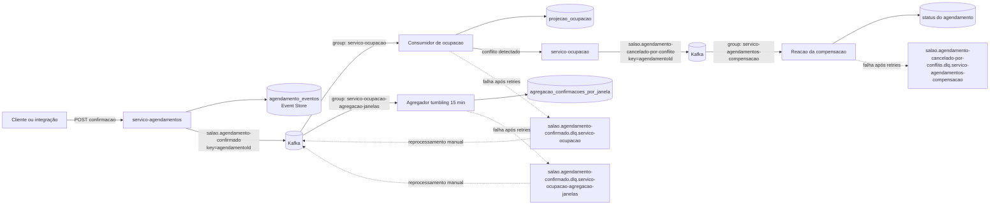

# Arquitetura do sistema de agendamentos

Este documento descreve a arquitetura que deve ser mantida para o sistema de
agendamentos de um salão de beleza. Ele é uma referência operacional: explica o
domínio, os eventos, os consumidores, as decisões já tomadas e a forma de
diagnosticar falhas sem depender do contexto em que cada etapa foi construída.

O sistema é composto por dois serviços Spring Boot, um broker Kafka e bancos
PostgreSQL separados logicamente. O `servico-agendamentos` é responsável pelo
agregado de agendamento e pela publicação de fatos. O `servico-ocupacao`
projeta a agenda dos profissionais e calcula uma visão agregada de confirmações.
Os serviços não fazem chamadas síncronas entre si para concluir o fluxo de
negócio; eles se comunicam por eventos.

## 1. Domínio

O domínio é a gestão de horários de um salão de beleza. Um cliente solicita um
horário, o sistema valida a possibilidade de atendimento e, quando a reserva é
confirmada, registra o fato de que aquele agendamento passou a ocupar o horário
de um profissional. A prioridade (`PADRAO`, `URGENTE` ou outros valores
válidos do negócio) acompanha a confirmação porque é usada na leitura
operacional de demanda.

O núcleo do fluxo é o agendamento identificado por `agendamentoId`. A
confirmação contém também `profissionalId`, `servicoId`, `inicioEm`, `prioridade`
e os dois relógios necessários para não misturar conceitos: `inicioEm` é o
horário reservado e `ocorridoEm` é o instante em que a confirmação aconteceu no
negócio. A diferença é importante para relatórios: uma mensagem entregue com
atraso continua pertencendo à janela de `ocorridoEm`.

O `servico-agendamentos` mantém o histórico do agregado `Agendamento` em
`agendamento_eventos`. Esse histórico é append-only e ordenado por
`(agendamento_id, versao)`. O estado não é a fonte primária: ele é reconstruído
aplicando os eventos do stream em ordem. Hoje o ciclo modelado contém:

- `AgendamentoConfirmado`;
- `AgendamentoCancelado` seguido de `SinalEstornado`;
- `AgendamentoNaoCompareceu` seguido de `MultaCobrada`.

O cancelamento e o não comparecimento são fatos separados para preservar a
sequência de negócio e permitir relatórios de estornos e multas. A tabela
`relatorio_faltas_estornos` é uma projeção derivada; se ela ficar defasada, o
event store continua permitindo sua reconstrução.

O segundo serviço mantém uma projeção de ocupação por agendamento. Ao receber
uma confirmação, ele verifica se o mesmo profissional já está ocupado no mesmo
`inicioEm`. Se não houver conflito, grava a ocupação. Se houver, não sobrescreve
uma reserva existente: publica um novo fato de compensação para que o serviço
de agendamentos marque o agendamento conflitante como
`CANCELADO_POR_CONFLITO`.

Esse é o caminho de exceção escolhido para a Saga: a confirmação já foi
publicada e o fluxo de ocupação detectou que um efeito não pode ser aplicado.
A compensação é outro evento no log, e não um `UPDATE`, um `DELETE`, uma chamada
direta ao outro serviço ou um comando chamado `CancelarReserva`.

## 2. Eventos

Os eventos de integração e seus campos estão documentados em
[`docs/contrato.md`](contrato.md). O contrato é a referência para nomes,
formatos, compatibilidade e significado semântico; as classes Java dos serviços
não substituem essa documentação.

### `salao.agendamento-confirmado.v1`

O evento é publicado no tópico `salao.agendamento-confirmado` pelo
`servico-agendamentos`, depois que a confirmação é validada e gravada na versão
1 do stream do agendamento. O payload contém:

| Campo | Uso |
| --- | --- |
| `eventoId` | Identidade da ocorrência e chave de deduplicação do consumidor. |
| `agendamentoId` | Agendamento e chave de partição do tópico. |
| `profissionalId` | Profissional cuja agenda será projetada. |
| `servicoId` | Serviço reservado. |
| `inicioEm` | Horário reservado, em ISO-8601 com offset. |
| `prioridade` | Classificação usada pela agregação por janela. |
| `ocorridoEm` | Tempo do fato, usado como event time. |

O envelope usa cabeçalhos CloudEvents, incluindo `ce_specversion`, `ce_id`,
`ce_source`, `ce_type` e `ce_time`. `ce_id` deve corresponder ao identificador
do evento e nunca pode ser removido durante uma ida à DLQ ou um reprocessamento.
O sistema atual usa `agendamentoId` como chave Kafka; isso preserva a ordem entre
eventos do mesmo agendamento, não entre agendamentos diferentes.

### `salao.agendamento.cancelado-por-conflito.v1`

Esse evento é publicado no tópico
`salao.agendamento-cancelado-por-conflito` pelo `servico-ocupacao` quando a
projeção detecta conflito para o par `(profissionalId, inicioEm)`. É um fato
consumado, com nome no particípio. Seus campos são `eventoId`,
`agendamentoId`, `profissionalId`, `inicioEm`, `motivo` e `ocorridoEm`.

O `eventoId` da compensação é novo, no formato atualmente gerado
`COMP-<eventoId-original>`. Ele não substitui nem reutiliza o `ce_id` da
confirmação. O consumidor do evento atualiza a projeção de status para
`CANCELADO_POR_CONFLITO` e deduplica por esse novo identificador.

Esse evento também usa cabeçalhos CloudEvents. Sua DLQ é
`salao.agendamento-cancelado-por-conflito.dlq.servico-agendamentos-compensacao`.
O contrato documenta o tópico, os campos, a rastreabilidade e a preservação dos
cabeçalhos.

### Eventos internos do agregado

`AgendamentoCancelado`, `SinalEstornado`, `AgendamentoNaoCompareceu` e
`MultaCobrada` são eventos persistidos no event store do
`servico-agendamentos`. Eles sustentam o ciclo de vida e a projeção de faltas e
estornos. Não são confundidos com comandos HTTP: os endpoints
`/cancelar` e `/nao-comparecimento` apenas solicitam uma transição; os fatos
persistidos são os eventos resultantes.

## 3. Desenho

O fluxo completo, incluindo o caminho de conflito e as DLQs, é:



O primeiro tópico tem dois grupos independentes. Por isso, a mesma confirmação
é entregue uma vez ao consumidor de ocupação e outra vez ao agregador; eles não
competem entre si. Dentro de cada grupo, uma partição é atribuída a apenas um
consumidor do grupo por vez.

O consumidor de ocupação grava `eventoId` em `eventos_processados` na mesma
transação do efeito da ocupação. O agregador faz o mesmo em
`eventos_processados_agregacao_janela`, junto do incremento da janela. Assim,
uma reentrega não duplica o efeito. O listener só confirma o offset depois do
processamento; se o serviço falhar antes do `ack`, o broker pode entregar o
registro novamente e a deduplicação torna essa reentrega segura.

O agregador usa janela tumbling de 15 minutos, alinhada ao quarto de hora,
agrupada por `prioridade` e calculada a partir de `ocorridoEm`. Ele não é uma
session window por cliente. O contrato atual não possui `clienteId`, portanto o
repartition por cliente definido no ADR-003 é uma evolução futura, não uma
capacidade que deve ser atribuída ao código atual.

## 4. Decisões

Os detalhes e alternativas estão nos ADRs. Este índice resume a consequência
que um mantenedor precisa lembrar antes de alterar o sistema:

| ADR | Decisão | Consequência operacional |
| --- | --- | --- |
| [ADR-002](adr/ADR-002-dominio-do-projeto.md) | Domínio de agendamentos de salão, com ocupação, sinal, estorno e falta. | O modelo precisa preservar prioridades, horários e exceções de negócio; um CRUD genérico não responde às perguntas operacionais do domínio. |
| [ADR-003](adr/ADR-003-chave-de-particao.md) | `clienteId` é a chave alvo para uma futura agregação por cliente, via repartition topic. | O contrato precisa evoluir de forma backward-compatible e o repartition adicionará latência, custo e uma nova superfície de idempotência; não se deve inventar `clienteId` no consumidor atual. |
| [ADR-005](adr/ADR-005-event-sourcing.md) | Event Sourcing somente no agregado `Agendamento`. | O event store é append-only e permite replay, mas exige controle de versão, upcasting futuro e cuidado com crescimento e dados pessoais. |
| [ADR-006](adr/ADR-006-resiliencia.md) | Retry limitado, DLQ por consumidor e Saga em coreografia. | Não existe uma fila morta única nem um coordenador central; a operação precisa conhecer cada grupo, dono e procedimento manual. |

A Saga é coreografada porque o fluxo é curto: o consumidor que detecta o
conflito publica o fato e o serviço que mantém o agendamento reage a ele. Essa
escolha evita um orquestrador adicional e mantém os serviços implantáveis de
forma independente. O custo é menor visibilidade linear: para responder em que
passo um agendamento está, é preciso correlacionar seus eventos e consultar as
projeções.

## 5. Quando falha

### Parte A — classificação, retry e DLQ

Falhas transitórias e permanentes têm tratamentos diferentes. A classificação
é feita pelo código dos consumidores, por uma lista explícita de exceções
permanentes; não é uma decisão delegada ao broker.

Falhas transitórias incluem indisponibilidade temporária do PostgreSQL, timeout
de rede, deadlock recuperável e erros técnicos equivalentes. O
`DefaultErrorHandler` retenta com backoff exponencial de 1 s, 2 s e 4 s. Isso
representa três retries após a tentativa inicial, portanto até quatro execuções
do processamento. Se todas falharem, o registro é publicado na DLQ derivada
do tópico original e do `group.id`.

Falhas permanentes incluem JSON malformado, campo obrigatório ausente, formato
de data inválido e regra de negócio violada. Hoje `JacksonException` e
`IllegalArgumentException` são classificadas explicitamente como não
retentáveis. Elas vão diretamente à DLQ. Retentar uma mensagem venenosa
bloqueia o offset daquela partição, impede a entrega dos eventos seguintes e
faz o lag crescer sem chance de recuperação.

As mensagens das DLQs devem conservar o payload original byte a byte, a chave,
todos os cabeçalhos CloudEvents originais e os cabeçalhos técnicos da falha.
O motivo deve permitir descobrir a exceção, a mensagem, o tópico, a partição,
o offset de origem e o instante da falha. Em particular, `ce_id` é indispensável
para que o reprocessamento possa reencontrar a identidade usada na
deduplicação.

As DLQs e seus donos são:

| Origem | DLQ | Dono |
| --- | --- | --- |
| `salao.agendamento-confirmado`, grupo `servico-ocupacao` | `salao.agendamento-confirmado.dlq.servico-ocupacao` | equipe do `servico-ocupacao` |
| `salao.agendamento-confirmado`, grupo `servico-ocupacao-agregacao-janelas` | `salao.agendamento-confirmado.dlq.servico-ocupacao-agregacao-janelas` | equipe do `servico-ocupacao` |
| `salao.agendamento-cancelado-por-conflito`, grupo `servico-agendamentos-compensacao` | `salao.agendamento-cancelado-por-conflito.dlq.servico-agendamentos-compensacao` | equipe do `servico-agendamentos`, tratamento até o próximo dia útil |

Não há reprocessamento automático em laço. No ambiente atual, as duas DLQs do
`servico-ocupacao` podem ser drenadas de forma explícita pelos endpoints:

```text
POST /admin/dlq/ocupacao/reprocessar
POST /admin/dlq/janela/reprocessar
```

O operador deve corrigir a causa raiz, inspecionar a mensagem e então acionar o
endpoint. O reprocessador usa um grupo dedicado, desliga `enable.auto.commit`,
republica payload e cabeçalhos e só faz `commitSync` depois de confirmar todas
as republicações da leva. A idempotência por `eventoId` torna seguro reencontrar
uma mensagem que já tenha produzido efeito. A DLQ da compensação é operada
manualmente, mas ainda não possui endpoint equivalente neste serviço; seu
tratamento deve ser uma ação operacional explícita, nunca um job cíclico.

### Parte B — Saga e falha da compensação

No caminho feliz, `servico-agendamentos` grava `AgendamentoConfirmado` e
publica a confirmação. O `servico-ocupacao` grava a ocupação. No caminho de
exceção, ele encontra outra ocupação do mesmo profissional e horário, não
grava a nova ocupação e publica `AgendamentoCanceladoPorConflito`. O
`servico-agendamentos` consome esse fato e aplica
`CANCELADO_POR_CONFLITO` à projeção de status.

A publicação da compensação é assíncrona e ocorre por tópico; não existe
chamada síncrona entre os serviços. A compensação não é um comando: é um fato
novo, com `eventoId` próprio, registrado no contrato.

A própria compensação também pode falhar. JSON inválido ou `motivo` ausente vai
direto à DLQ da compensação. Uma indisponibilidade transitória do banco ou
outra falha técnica recebe o mesmo orçamento de retry de 1 s, 2 s e 4 s. O
listener só confirma o offset após aplicar o efeito. O consumidor deduplica
pelo `eventoId` da compensação, de modo que repetir o evento não deve aplicar
o cancelamento duas vezes nem produzir um segundo efeito de negócio. Se as
tentativas acabarem, a mensagem fica na DLQ própria, sob responsabilidade da
equipe de agendamentos e com tratamento até o próximo dia útil.

## 6. Quando cresce

O paralelismo real é limitado pelo número de partições. Dentro de um grupo,
cada partição é lida por exatamente um consumidor; instâncias adicionais acima
desse número ficam ociosas. Portanto, aumentar réplicas sem aumentar partições
não reduz o lag. O `maxReplicaCount` de qualquer autoscaler deve ser no máximo
o número de partições do tópico consumido.

No desenho atual, a chave de `salao.agendamento-confirmado` é
`agendamentoId`. Isso distribui agendamentos diferentes e preserva a ordem de
um mesmo agendamento. O domínio, porém, pode concentrar carga em poucos
profissionais, horários ou clientes. Se a chave escolhida tiver baixa
cardinalidade, todos os eventos daquele valor irão para a mesma partição:
essa partição fica quente e uma segunda instância não consegue ajudar.

O diagnóstico deve olhar o lag por grupo e por partição, nunca apenas o total.
Um total aparentemente baixo pode esconder uma partição quente parada enquanto
as demais estão vazias. A decisão de escalar deve usar lag e idade do evento
mais antigo não processado, não CPU. CPU baixa pode significar consumidor
ocioso, mas também consumidor bloqueado esperando PostgreSQL, Kafka ou outra
dependência de I/O.

Para o agregador atual, o objetivo é manter contagens por janela e prioridade.
Se a pergunta passar a ser atividade por cliente, o contrato deverá receber
`clienteId` de modo backward-compatible. Só então o repartition topic poderá
republicar o mesmo registro com `clienteId` como chave, preservando corpo e
cabeçalhos. Essa passagem extra aumenta latência e custo e exige idempotência
tanto no repartitionador quanto no agregador. Mesmo depois disso, um cliente
muito ativo poderá formar uma partição quente; afinidade de sessão troca parte
do paralelismo por consistência de agrupamento.

O Event Store cresce em append-only. O fluxo modelado produz poucos eventos
por agendamento, mas uma operação maior exigirá arquivamento de streams antigos,
índices adequados e uma política de upcasting. Projeções devem continuar sendo
reconstruíveis a partir dos fatos, em vez de se tornarem uma segunda fonte de
verdade.

## 7. O que se enxerga

A pergunta operacional principal é: **onde está o pedido/agendamento X?**
Para respondê-la em todos os serviços, cada evento deve carregar, além do
`ce_id`, um identificador de correlação W3C `traceparent` (ou `trace_id`
equivalente). Esse valor deve atravessar a API, o event store, os cabeçalhos
Kafka, as DLQs e o reprocessamento. O `ce_id` identifica o fato; o
`trace_id` liga os fatos e efeitos de uma mesma operação. O código atual já
propaga os cabeçalhos CloudEvents, mas ainda não implementa `traceparent`
end-to-end; essa é uma lacuna explícita para uma operação real.

Os quatro sinais prioritários são:

1. **Lag por grupo e partição.** Medir separadamente
   `servico-ocupacao`, `servico-ocupacao-agregacao-janelas` e
   `servico-agendamentos-compensacao`. Usar a partição para localizar a
   concentração, não somente um número agregado.
2. **Idade do evento mais antigo não processado.** Um lag de poucas mensagens
   pode ser grave se a mensagem mais antiga estiver parada há horas; a idade
   revela a urgência operacional.
3. **Taxa de entrada na DLQ.** Acompanhar contagem e taxa por tópico, grupo,
   tipo de exceção e motivo. Um aumento de `JacksonException` aponta contrato
   ou produtor; um aumento de falhas técnicas aponta dependência instável.
4. **Tempo do fato até o efeito.** Calcular de `ocorridoEm`/`ce_time` até a
   gravação da projeção de ocupação, da janela ou do status compensado. Esse
   indicador mostra a experiência do fluxo e inclui atraso de broker, retry e
   espera de I/O.

Logs estruturados devem incluir `trace_id`, `ce_id`, `eventoId`,
`agendamentoId`, tópico, partição, offset, grupo, tentativa atual e resultado
(`processado`, `duplicado`, `dlq`, `compensacao_publicada`). A deduplicação não
deve ser silenciosa: uma reentrega ignorada é esperada, mas precisa ser
visível para distinguir entrega pelo menos uma vez de perda.

Para investigar um agendamento, começar pelo `trace_id` e pelo
`agendamentoId`, conferir o evento no tópico original, os offsets de cada
grupo, as tabelas `eventos_processados` e
`eventos_processados_agregacao_janela`, a projeção de ocupação e, se houver
conflito, o evento e o status da compensação. Se houver DLQ, preservar o
`ce_id` durante a análise e só reprocessar depois de corrigir a causa raiz.

## 8. O que ficou de fora e o custo de fazer

O escopo atual não implementa gateway de pagamento real, notificações SMS/e-mail,
reagendamento, fila de espera, cobrança proporcional, nem um coordenador
central de Saga. O domínio prevê sinal, estorno e multa no Event Sourcing, mas
essas transições ainda são internas ao agregado e não integram um gateway
externo. Fazer isso exigiria novos contratos, consumidores idempotentes,
timeouts, DLQs por integração, reconciliação e uma decisão entre coreografia
mais extensa e orquestração.

Também ficou de fora a session window por cliente. O custo de fazê-la
corretamente é evoluir o contrato com `clienteId`, criar o repartition topic,
operar uma passagem adicional pelo Kafka, tratar partições quentes e testar
reentregas em duas camadas. Inventar esse campo no consumidor seria mais barato
no código, mas quebraria a garantia de preservar o evento original e produziria
uma arquitetura sem fonte legítima da chave.

O reprocessamento da DLQ da compensação ainda precisa de uma ferramenta
administrativa equivalente à existente no `servico-ocupacao`. A criação dessa
ferramenta deve manter as mesmas garantias: ação manual, grupo dedicado,
`enable.auto.commit=false`, republicação confirmada antes do commit e
preservação byte a byte de payload e cabeçalhos. Automatizar essa rotina em
loop reduziria o trabalho imediato, mas poderia reintroduzir uma falha
permanente indefinidamente.

Por fim, tracing W3C, métricas por partição e alertas de idade/DLQ precisam ser
instrumentados para operação fora do ambiente local. O custo inclui
propagação de cabeçalhos, armazenamento de métricas, dashboards, retenção e
rotina de plantão. Esse custo é aceito porque, sem correlação e sem as quatro
métricas de fluxo, o sistema pode parecer saudável por CPU enquanto perde
progresso em uma partição quente ou acumula mensagens venenosas em uma DLQ.
